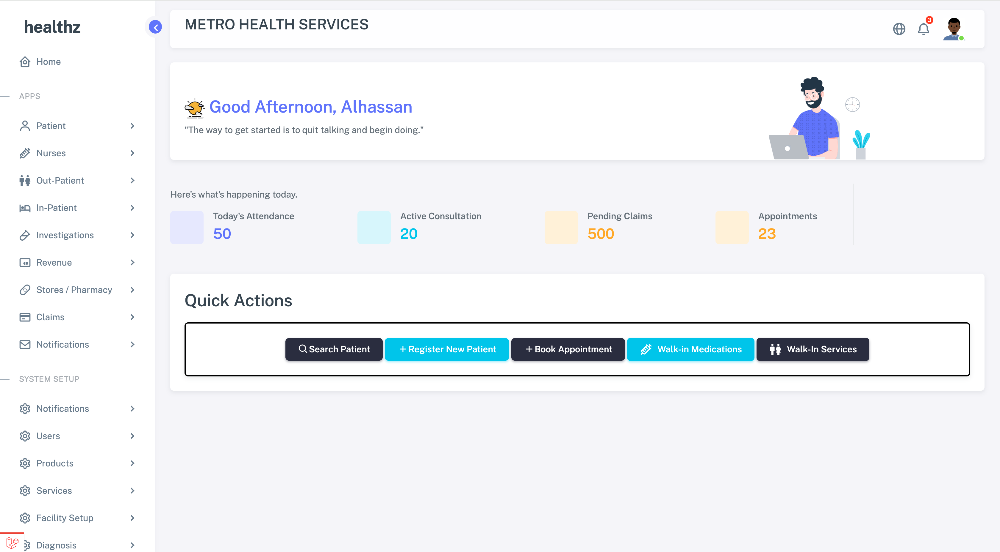
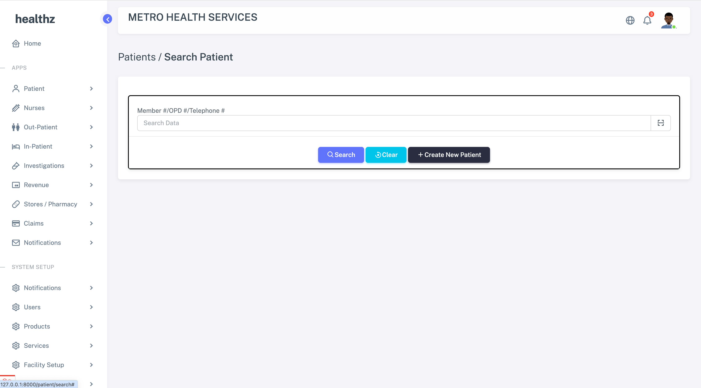
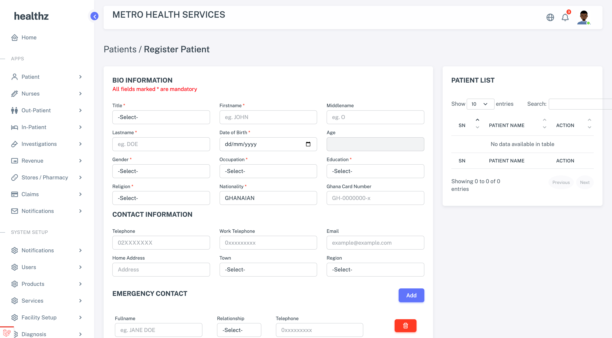
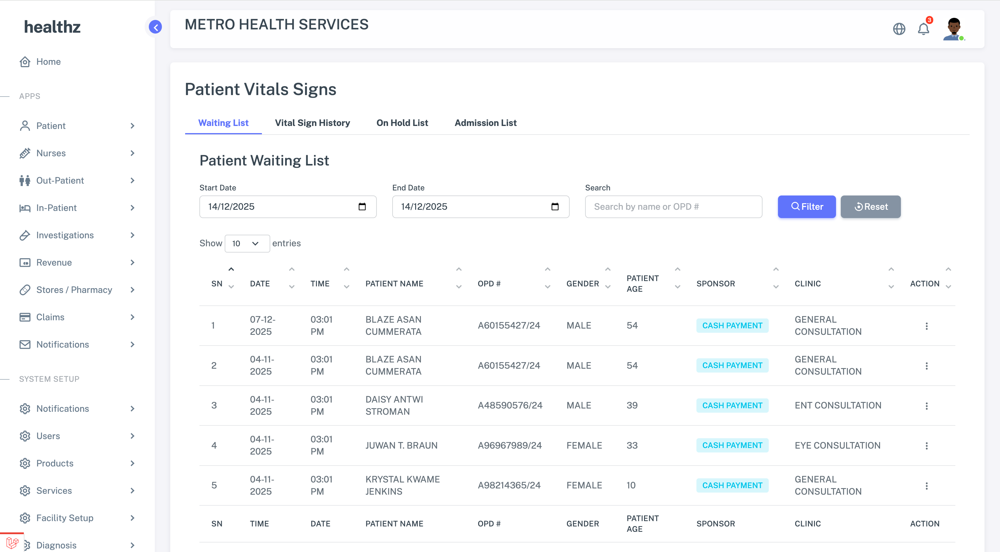

# Healthz – Hospital Administration & Management System
 
Healthz is a comprehensive, modular hospital administration and management system designed to streamline daily clinical and administrative workflows. 
It centralizes patient information, medical records, investigations, consultations, prescriptions, diagnoses, sponsorships, attendance tracking, and claims processing, with native support for XML-based claim generation and submission.

Healthz enhances operational efficiency, reduces manual errors, and provides medical teams with a unified platform for handling patient journeys from registration to billing.

 

---

## Key Features

### 1. Patient Registration & Demographics
- Create and manage patient profiles.
- Store demographic details, contact information, next-of-kin, and medical identifiers.
- Support multiple sponsorship types (private, corporate, insurance).

### 2. Sponsorship & Eligibility Management
- Link patients to one or more sponsorship or insurance schemes.
- Track sponsorship validity, coverage, and claim requirements.
- Define sponsorship-specific pricing rules and billing structures.

### 3. Attendance & Consultation Tracking
- Record daily patient attendance and consultation visits.
- Log consulting providers, visit reasons, vitals, and encounter notes.
- Track patient flow across departments.

### 4. Clinical Investigations
Manage ordering and result tracking for:
- **Laboratory tests**
- **Ultrasound scans**
- **MRI**
- **ECG**

Each investigation includes order details, results, timestamps, staff information, and status management.

### 5. Prescriptions & Medication Orders
- Generate and manage prescriptions.
- Track drug orders, dosage, frequency, and duration.
- Integrate with pharmacy workflows.

### 6. Diagnosis Management
- Assign one or multiple diagnoses per encounter.
- Support ICD-coded or facility-defined diagnosis sets.
- Maintain diagnosis history linked to claims.

### 7. Claims Processing
- Generate itemized claims based on clinical encounters, investigations, medications, and diagnoses.
- Validate claims against sponsor rules.
- Track claim statuses (pending, submitted, approved, rejected).

#### XML Claim Generation
- Produce claim files in **XML format** following sponsor or industry schemas.
- Export or directly submit claim files.
- Store claim versions for auditing and reconciliation.

---

## Core Objectives
- Improve operational efficiency across hospitals and clinics.
- Provide a unified system connecting administrative and clinical workflows.
- Minimize human error through structured digital processes.
- Increase accountability using auditable records.
- Enable seamless interaction with sponsors and insurers.

---

## System Workflow Overview
1. Patient registration  
2. Attendance creation  
3. Consultation with notes, vitals, and diagnoses  
4. Investigations ordered and processed  
5. Prescriptions issued  
6. Billing and claims assembled  
7. XML claim generated and submitted  

---

## Technology Stack 
- **Backend:** PHP (Laravel)  
- **Database:** MySQL  
- **Formats:** JSON, XML  
- **API-Ready:** RESTful integration supported  

---

## Target Users
- Hospitals  
- Clinics  
- Health centers  
- Corporate medical units  
- Insurance-connected providers  

---

## Module Overview

| Module | Description |
|--------|-------------|
| Patient Registry | Handles demographics, sponsors, and identification. |
| Attendance | Logs visits and encounters. |
| Consultation | Captures provider notes, vitals, diagnoses, and visit details. |
| Investigations | Manages lab tests, imaging, and diagnostics. |
| Medications | Prescription and fulfillment tracking. |
| Billing | Produces chargeable items for claims. |
| Claims | Builds structured claim documents. |
| XML Engine | Generates and submits XML claim files. |

---

## Future Enhancements
- HL7/FHIR interoperability  
- Real-time insurance API validation  
- Role-based dashboards  
- Automated notifications  

---

 
 